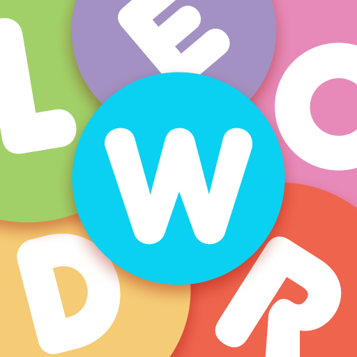

<a name="readme-top"></a>

<!-- PROJECT LOGO -->
<br />
<div align="center">
  <a href="https://github.com/ed6dev/Wordle_Discord_Bot">
    
  </a>

<h3 align="center">Wordle Discord Bot</h3>

  <p align="center">
    A Simple Remake Of The Famous Game "Wordle"!
    <br />
    <a href="https://github.com/github_username/repo_name/issues">Report Bug</a>
    ·
    <a href="https://github.com/github_username/repo_name/issues">Request Feature</a>
  </p>
</div>


<!-- TABLE OF CONTENTS -->
<details>
  <summary>Table of Contents</summary>
  <ol>
    <li>
      <a href="#about-the-project">About The Project</a>
      <ul>
        <li><a href="#built-with">Built With</a></li>
      </ul>
    </li>
    <li>
      <a href="#getting-started">Getting Started</a>
      <ul>
        <li><a href="#prerequisites">Prerequisites</a></li>
        <li><a href="#installation">Installation</a></li>
      </ul>
    </li>
    <li><a href="#usage">Usage</a></li>
    <li><a href="#roadmap">Roadmap</a></li>
    <li><a href="#contributing">Contributing</a></li>
    <li><a href="#license">License</a></li>
    <li><a href="#contact">Contact</a></li>
    <li><a href="#acknowledgments">Acknowledgments</a></li>
  </ol>
</details>


<!-- ABOUT THE PROJECT -->
## About The Project

[![Product Name Screen Shot][product-screenshot]](https://discord.gg/dZ2FyjGT4C)

Welcome to **Wordle**, your Discord server's new favorite game companion! Keep your community engaged and entertained with this dynamic and brain-teasing word puzzle bot.

## Features

- **Stay Active and Entertained:** Inject life into your server with an engaging word puzzle game that keeps your members coming back for more.
- **Brain-Teasing Gameplay:** Crafted using JavaScript and Node.js, Wordle offers a fresh twist on the classic game. Can you guess the five-letter word before time runs out?
- **User Insights:** Delve into in-depth user statistics. Track your game history, wins, win rates, and more to chart your progress and strive for improvement.
- **Personalized Tracking:** Keep tabs on your best score, fastest solve time, and other achievements, showcasing your prowess as a Wordle master.
- **Time-Tested Challenges:** With a repository of 500 unique five-letter words, every game presents a novel challenge.
- **Future-Ready:** This is just the beginning! The Wordle team has exciting plans for future updates and additional features, making it a consistently evolving source of fun.

<p align="right">(<a href="#readme-top">back to top</a>)</p>


<!-- GETTING STARTED -->
## Getting Started

This is an example of how you may give instructions on setting up your project locally.
To get a local copy up and running follow these simple example steps.

### Installation & Startup ( Without Bat Files )

1. Clone the repo
   ```sh
   git clone https://github.com/ed6dev/Wordle_Discord_Bot.git
   ```
3. Install NPM packages
   ```sh
   npm install discord.js dotenv mongoose djs-commander axios
   ```
4. Enter your Token , Client_Id And Your MongoDb_Uri in `.env`
   ```
   TOKEN = MLOIOOHDH282938...
   CLIENT_ID = 11443845...
   MONGODB = mongodb+srv://e...
   ```
5. Enter Your Dev(s) Id(s) in `config.json`
   ```json
   {
    "devs": ["123","9029","..."]
   }
   ```
6. Finally Run The Project
   ```sh
   node index.js
   ```


<p align="right">(<a href="#readme-top">back to top</a>)</p>


### Installation & Startup ( Without Bat Files )

1. Clone the repo
   ```sh
   git clone https://github.com/ed6dev/Wordle_Discord_Bot.git
   ```
3. Open `setup.bat`
4. Enter your Token , Client_Id And Your MongoDb_Uri in `.env`
   ```
   TOKEN = MLOIOOHDH282938...
   CLIENT_ID = 11443845...
   MONGODB = mongodb+srv://e...
   ```
5. Enter Your Dev(s) Id(s) in `config.json`
   ```json
   {
    "devs": ["123","9029","..."]
   }
   ```
6. Finally Run The Project
   ```sh
   node index.js
   ```

<p align="right">(<a href="#readme-top">back to top</a>)</p>


<!-- USAGE EXAMPLES -->
## Usage

> - ``/ping`` : This Command Gives You The Bot's Ping in ms
> - ``/start`` : this Command Start The Wordle Game
> - ``/info`` : This Command Shows A Specified User Info (Games Won , Win Rate...)

<p align="right">(<a href="#readme-top">back to top</a>)</p>


<!-- CONTACT -->
## Contact

You Can Find Me On Discord - [@ed6.](https://discord.com/users/696296117180039219)

Project Link: [Click Here](https://github.com/ed6dev/Wordle_Discord_Bot)

<p align="right">(<a href="#readme-top">back to top</a>)</p>


<!-- MARKDOWN LINKS & IMAGES -->
[product-screenshot]: images/screenshot.png